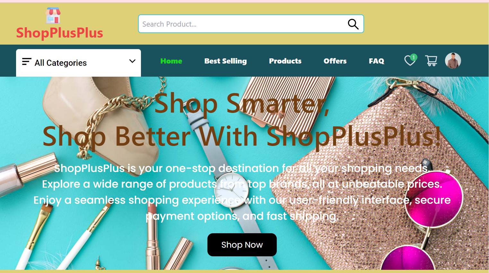
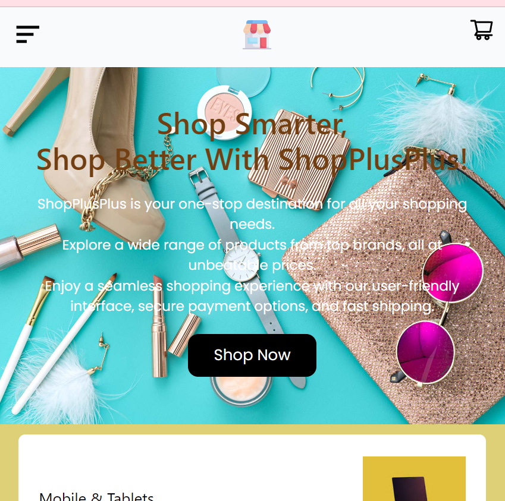
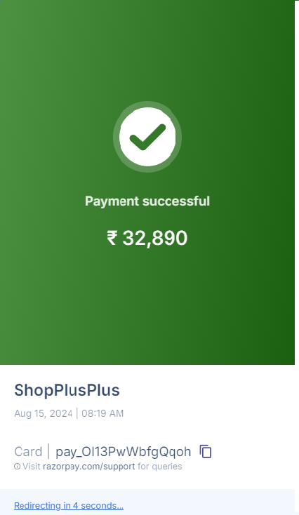

# ShopPlusPlus App README

## Tech Stack

### Frontend
- **React**: Building the user interface.
- **Redux**: State management.
- **Tailwind CSS**: Styling with utility-first CSS classes.
- **Material-UI (MUI)**: UI components, including DataGrid.
- **React Router**: Routing within the application.

### Backend
- **Node.js**: Server-side logic.
- **Express.js**: Web framework for Node.js.
- **MongoDB**: Database for storing users, products, orders, etc.
- **Mongoose**: Object Data Modeling (ODM) for MongoDB.
- **Cloudinary**: Image management and storage (e.g., product images).
- **Razorpay**: Payment processing (in test mode).

### Deployment
- **Vercel**: For deploying the application.
- **MongoDB Atlas**: For hosting the MongoDB database.

### Other Tools
- **JWT (JSON Web Tokens)**: Authentication and authorization.
- **Axios**: HTTP requests from the frontend to the backend.
- **Lottie**: Loading animations.
- **Snackbar**: Notifications.

### How to Deploy It Locally

To deploy the ShopPlusPlus app locally, follow these steps:

1. **Clone the repository:**
  - git clone https://github.com/Rubina2563/ShopPlusPlus.git
  - cd ShopPlusPlus

2. **Install dependencies for both frontend and backend:**

   Navigate to the frontend directory and install dependencies:
  - cd frontend
  - npm install
   
 3. **Then, navigate to the backend directory and install dependencies:**
  - cd ../backend
  - npm install
   
 4. **Start the frontend:**
  In the frontend directory, run:
  - npm start
  - Change all my vercel url to your local port

5. **Start the backend:**
In the backend directory, run:
- npm run dev
- Change all my vercel url to your local port

## Overview

This e-commerce platform is a sophisticated multi-user, single-admin application designed to provide a seamless shopping experience. It includes robust features such as user-specific wishlists and carts, dynamic product searching, order tracking, and comprehensive profile management. The platform also offers full control to the admin for product and order management, including handling refunds and monitoring sales metrics. The design emphasizes persistence, ensuring that users' data like wishlists and carts remain intact across sessions.

## Features

### User Features

1. **User Authentication:**
   - Users must register and log in to fully interact with the platform, particularly to add items to their wishlist or cart.
   - Although users can browse products and search through categories without logging in, wishlist and cart functionalities are restricted to authenticated users.

2. **Wishlist and Cart Management:**
   - Each user's wishlist and cart are tied to their unique account.
   - Items added to the wishlist or cart remain specific to the user and persist across sessions. If a user logs out and then logs back in, their previous wishlist and cart contents are restored.
   - This feature ensures that users do not lose their selections, enhancing the shopping experience by allowing users to save products for later without concern of data loss.

3. **Product Browsing and Searching:**
   - The platform offers a categorized product browsing feature, enabling users to filter products by categories and find items that match their interests.
   - An event timer feature highlights ongoing offers and discounts, motivating users to take advantage of limited-time deals.

4. **Profile Management:**
   - Users can manage their profiles, including updating personal information such as their name, email, and contact details.
   - The platform allows users to add multiple addresses (default, home, or office) for easy selection during the checkout process.
   - Users can track their order status directly from their profile, providing transparency and up-to-date information on their purchases.

5. **Order Reviews and Ratings:**
   - After receiving their orders, users can leave reviews and ratings on the products they purchased.
   - Reviews and ratings are essential for building trust and providing feedback to other potential buyers.
   - Users can also request refunds directly through their profiles. Refund requests are subject to admin approval, and users are notified of the outcome.

### Admin Features

1. **Admin Authentication:**
   - The platform is designed for a single admin user. The admin can log in through the `/shop-login` route using the email "tazakaejaz13@gmail.com" and the password "1234".
   - Upon logging in, the admin is redirected to the admin profile page, where they have full control over the platform's operations.

2. **Product Management:**
   - The admin can add new products to the platform, ensuring that the inventory is up-to-date.
   - The admin can also delete products that are no longer available or needed.
   - Product details, such as the number of items sold, reviews, and ratings, are dynamically updated based on user interactions. This real-time update ensures that the admin has the most accurate information at all times.

3. **Order Management:**
   - The admin has full visibility into all orders placed on the platform.
   - Orders can be tracked by the admin, and the status of each order can be updated (e.g., pending, shipped, delivered).
   - Once an order is marked as delivered, the total amount for that order becomes visible on the admin dashboard, allowing the admin to monitor earnings.
   - Any change in the order status is reflected in the respective user's profile, ensuring that users are kept informed about their orders.

4. **Refund Management:**
   - The admin is responsible for approving refund requests submitted by users.
   - Approved refunds are processed, and the amount is adjusted on the admin dashboard, reflecting the accurate financial status.
   - The platform provides a transparent refund process, ensuring that both the admin and users are kept informed about the status of refund requests.

5. **Dashboard Insights:**
   - The admin dashboard provides comprehensive insights into the platform's performance.
   - Metrics such as sold quantities, total earnings, product reviews, and ratings are dynamically updated in real-time.
   - These insights help the admin make informed decisions about inventory management, pricing strategies, and promotional activities.

### Image Management

- **Cloudinary Integration:**
  - The platform uses Cloudinary for managing and storing images efficiently.
  - Cloudinary provides robust image optimization, ensuring that images are served quickly and in the best possible quality.
  - This integration supports dynamic image transformations, allowing the admin to manage product images with ease.
  
### Payment Methods

1. **Cash on Delivery (COD):**
   - Users can opt for Cash on Delivery, allowing them to pay for their orders upon delivery.
  

1. **Razorpay Integration:**
   - The platform is integrated with Razorpay, a popular payment gateway, to handle online transactions.
   - The Razorpay integration is currently in test mode, providing a secure environment for testing payment processes without real financial transactions.Changing its keys to live mode will transfer it to real world payment system.
   - Users can choose Razorpay to make secure online payments, enhancing the platform's flexibility.

### Important Notes

1. **Single-Admin Restriction:**
   - **Critical:** The platform is explicitly designed to support only one admin. Attempting to create multiple admins through the shop API can lead to significant conflicts, particularly in managing orders and cart items.
   - **Conflict Risks:**
     - If multiple admins are created, the platform may face issues such as order duplication, incorrect product status updates, and inconsistencies in cart management, especially when products are managed across different "shops."
     - These conflicts can result in a poor user experience and operational inefficiencies.
   - **Mitigation:**
     - To avoid these issues, only use the provided email and password for admin login.
     - If there is a need to switch admins or test with a different admin, ensure that the current admin's data is completely cleared. This includes:
       - Removing all existing orders.
       - Emptying all wishlists and carts.
       - Deleting all products associated with the previous admin.
     - Following these steps ensures that the platform remains functional and avoids potential conflicts.

2. **Razorpay Test Mode:**
   - The platform uses Razorpay in test mode, meaning no real transactions are processed. Ensure you are using the correct test credentials when testing payment features.
   - This allows developers and testers to simulate transactions without any financial risk.

